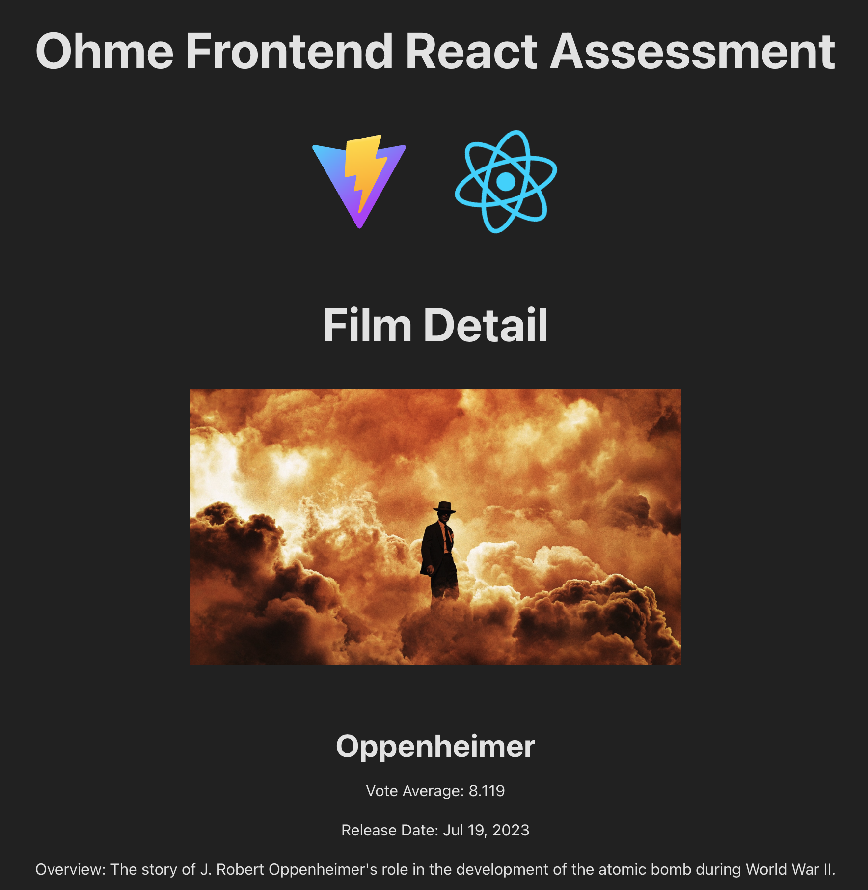

# Ohme Frontend React Assessment - Junior

Welcome to the Ohme Frontend React Assessment! This assessment is designed to evaluate your skills and understanding of building React applications.

## Overview

In this assessment, you will be building a film browsing application using React. The application will include functionality to view a list of films, search/filter the films list, view detailed information about each film, and to navigate from the list view to the detailed view. The data for the films will be fetched from The Movie Database (TMDB) API.

<center>
  
  
</center>

## Your Tasks

Your task is to implement the following components:

1. **_/App.jsx_** -  
   Create routes for the film list (FilmList) and film detail (FilmDetail) pages.  
   Add a link to the film detail page on the film list page.
2. **_/FilmList.jsx_** -  
   Fetch the list of films from the TMDB API.  
   Display the films in a grid format.  
   For each film, display the title, vote average, release date, and film poster.  
   Implement a loading state and a state for handling no films or errors.  
   Format the release date in the format: "Jan 9th, 2024".  
   Add a search bar to filter films by title.  
   Enable navigation to the film's detail page when clicked.
3. **_/FilmDetail.jsx_** -  
   Fetch and display detailed information of the selected film from the TMDB API.  
   Implement a loading state and a state for handling no film or errors.  
   Display the film's title, vote average, release date, poster, and an overview.  
   Format the release date as specified.

## Requirements

The user should...

1. see a list of all the latest films with the required details.
2. be able to search from the list and only see the desired films.
3. be able to click the desired film and be navigated to the details page for that film.

## Example Data

- `https://api.themoviedb.org/3/discover/movie?api_key=${import.meta.env.VITE_API_KEY}`

```json
[
    ...
    {
        "adult": false,
        "backdrop_path": "/fm6KqXpk3M2HVveHwCrBSSBaO0V.jpg",
        "genre_ids": [
            18,
            36
        ],
        "id": 872585,
        "original_language": "en",
        "original_title": "Oppenheimer",
        "overview": "The story of J. Robert Oppenheimer's role in the development of the atomic bomb during World War II.",
        "popularity": 482.547,
        "poster_path": "/8Gxv8gSFCU0XGDykEGv7zR1n2ua.jpg",
        "release_date": "2023-07-19",
        "title": "Oppenheimer",
        "video": false,
        "vote_average": 8.1,
        "vote_count": 6166
    },
]

```

## Getting Started

1. Clone the repository to your local machine.  
   `git clone git@github.com:OhmEnergy/ohme-FE-react-assessment-junior.git`
2. Install the required dependencies.  
   `pnpm i`
3. Run the app.  
   `pnpm dev`

### Environment Variables \*

We are using **[Vite](https://vitejs.dev/guide/env-and-mode)** - so handling environment variables are handled differently. Please read the docs for more info.

## Advanced

How would you improve this project?  
What other approaches could we take?  
What packages could we use?

## Support

We encourage you to ask questions throughout the assessment. We are just as interested in **_HOW_** you approach this task as we are in the result.

**Best of luck, and enjoy!**
